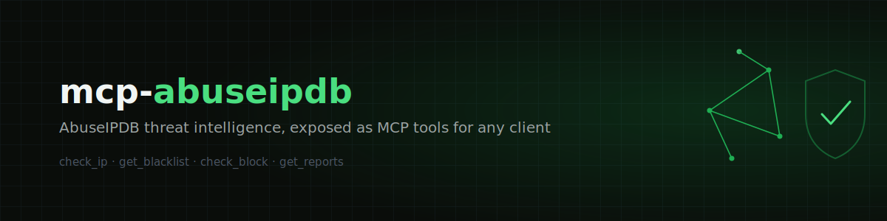

<p align="center">
  
</p>

<p align="center">
  <a href="https://github.com/abe-source/mcp-abuseipdb/blob/main/LICENSE"></a>
  = 18">
  
  
</p>

An [MCP](https://modelcontextprotocol.io) server that exposes [AbuseIPDB](https://www.abuseipdb.com) threat intelligence as tools — ask Claude (or any MCP client) whether an IP, subnet, or set of reports looks malicious, and get real data back instead of a guess.

## Tools

| Tool | What it does |
|------|---------------|
| `check_ip` | Check a single IP — abuse confidence score, ISP, country, usage type, report count, optionally the last 10 individual reports |
| `check_block` | Check a CIDR network block (up to `/16`) — network range info plus a per-IP breakdown of any reported addresses inside it |
| `get_reports` | Get the individual abuse reports filed against an IP — who reported it, why, and when, paginated |
| `get_blacklist` | Get the most-reported IPs overall. Free tier is capped at confidence 100 regardless of what you ask for; paid tiers can widen the range |

## Prerequisites

- Node.js 18+
- A free [AbuseIPDB API key](https://www.abuseipdb.com/register) (free tier: 1,000 checks/day, 5 blacklist calls/day)

## Setup

```bash
git clone https://github.com/abe-source/mcp-abuseipdb.git
cd mcp-abuseipdb
npm install
npm run build
```

Add it to your MCP client config (e.g. Claude Desktop's `claude_desktop_config.json`):

```json
{
  "mcpServers": {
    "abuseipdb": {
      "command": "node",
      "args": ["/absolute/path/to/mcp-abuseipdb/dist/index.js"],
      "env": {
        "ABUSEIPDB_API_KEY": "your-api-key-here"
      }
    }
  }
}
```

Restart your client, then try asking:

> "Has 8.8.8.8 been reported for anything?"
>
> "Check my office subnet 203.0.113.0/24 for abuse reports"
>
> "What are the most reported IPs right now?"

## How it works

```
MCP client (Claude, Inspector, ...)
        │  stdio, JSON-RPC
        ▼
  McpServer (src/server.ts)
        │
        ▼
  tools/*.ts     — one file per tool: Zod schema + handler, formats the reply
        │
        ▼
  endpoints/*.ts — one file per AbuseIPDB endpoint: typed request + response
        │
        ▼
  abuseipdbClient.ts — auth header, response envelope, AbuseIPDB error parsing
        │
        ▼
  client.ts      — generic fetch wrapper, timeout, HTTP error handling
        │
        ▼
  AbuseIPDB REST API
```

Each layer knows nothing about the one above it. `client.ts` doesn't know AbuseIPDB exists; `endpoints/` doesn't know MCP exists. Adding a new tool means one new file in `endpoints/`, one new file in `tools/`, one line in `tools/index.ts` — nothing else changes.

Tool arguments are validated with [Zod](https://zod.dev) before any handler runs — a malformed request never reaches the API.

## Development

```bash
npm run build   # compile TypeScript
npm run lint     # check formatting + lint rules
npm run check    # lint + format + fix, in place
```

Test locally with the [MCP Inspector](https://github.com/modelcontextprotocol/inspector):

```bash
npx @modelcontextprotocol/inspector --cli node --env-file=.env dist/index.js --method tools/call --tool-name check_ip --tool-arg ip=8.8.8.8
```

## License

MIT
